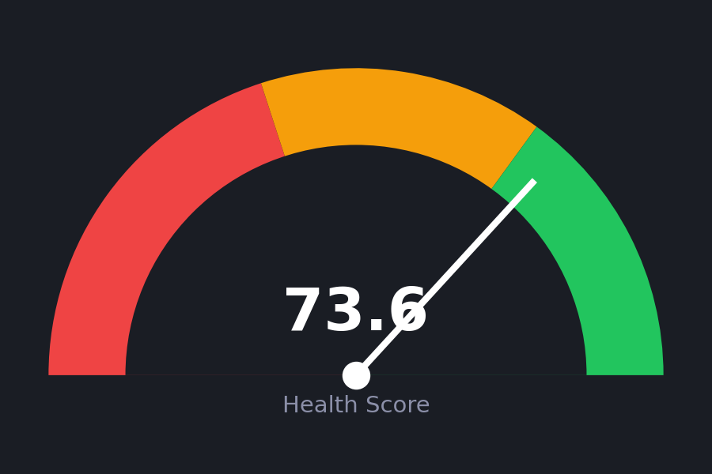
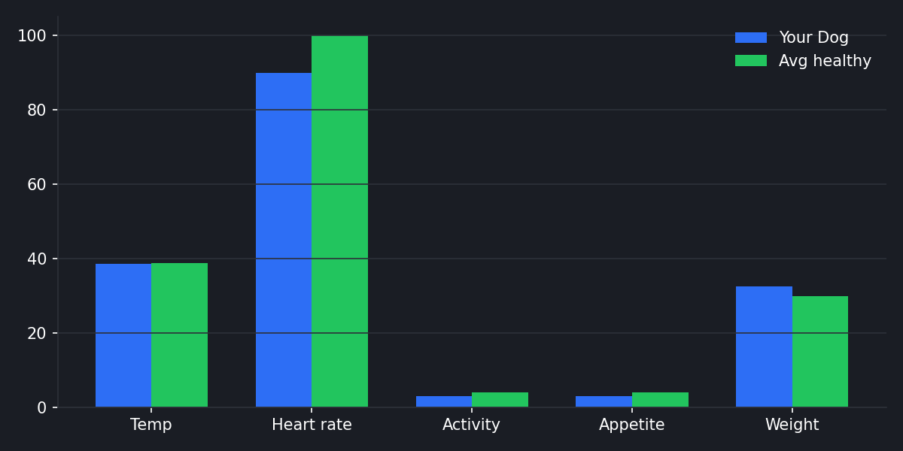
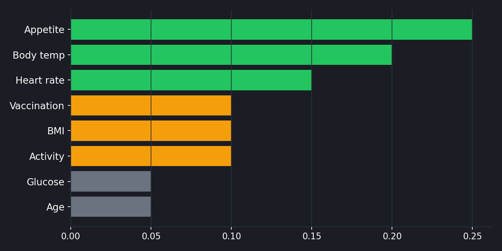

# Canine Health Prediction AI 🐶

AI-powered early detection of canine health conditions using Machine Learning.

## Features
- **Predictive Model:** Random Forest classifier that evaluates 8 key canine health features (Age, Weight, Temp, Heart Rate, Vaccination, Activity, Appetite, Breed Size).
- **Interactive UI:** Beautiful custom dark-themed Streamlit dashboard with real-time prediction and risk analysis.
- **Visual Insights:** 
  - Dynamic Health Score Gauge
  - Population Baseline Comparisons against average healthy dogs
  - Local SHAP Feature Importance visualisations showing how each factor influenced the prediction.

## Dashboard & Visualizations

### Health Score Gauge


### Population Comparison


### Feature Importance


## Installation & Setup

1. **Clone the repository:**
   ```bash
   git clone https://github.com/JenishPatoliya/canine-health-prediction.git
   cd canine-health-prediction
   ```

2. **Install the dependencies:**
   ```bash
   pip install -r requirements.txt
   ```

3. **Run the Streamlit Dashboard locally:**
   ```bash
   streamlit run app/app.py
   ```

## Project Structure
- `app/app.py`: The Main Streamlit UI Interface
- `src/train.py`: Model training, hyperparameter tuning, and cross-validation
- `src/preprocess.py`: Imbalanced-learn data scaling pipeline utilizing SMOTE
- `data/data_generator.py`: Custom synthetic veterinary dataset generator
- `models/`: Pickled trained estimators and scalers
